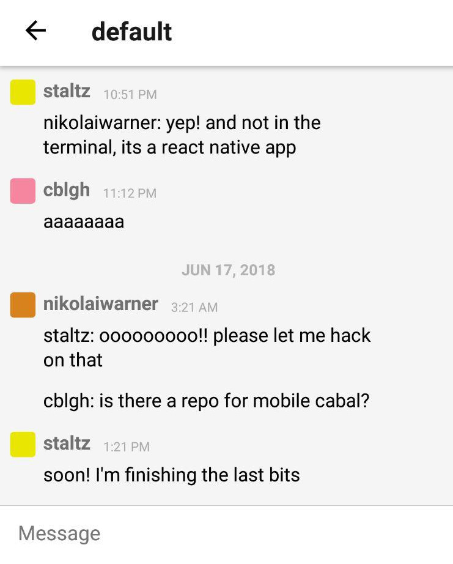

# Cabal Mobile

Chat with the p2p swarm on your mobile device (Android & iOS).



## Install

- Through GitHub Releases: [APK file](https://github.com/cabal-club/cabal-mobile/releases/download/1.0/app-release.apk)
- Through [Dat Installer](https://github.com/staltz/dat-installer/): `dat://199c8ad61f269fb243425895e315fab8fd2a8f96ced1c82899aea1895d9473ec`
- ~~From the Play Store: not yet~~

## Development

Credits go to the contributors of cabal-node, react-native, react-navigation, react-native-gifted-chat, and nodejs-mobile.

First make sure you follow the official React Native docs to setup your local environment with the necessary compilers for Android and/or iOS. Then, git clone this project, and install dependencies:

```bash
npm install
```

Also install dependencies in the backend project:

```bash
cd nodejs-assets/nodejs-project
npm install
```

Then run

```bash
npm run run-android
# or
npm run run-ios
```

## Troubleshooting

#### Android

If things go wrong, try rebuilding the backend:

```bash
cd android
./gradlew clean
cd ..
npm run run-android
```

#### iOS

...

## License

GPL 🤘
